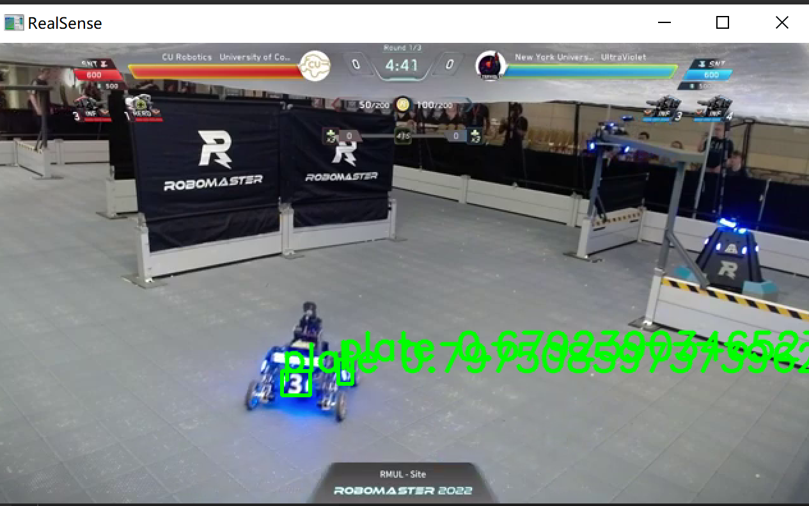
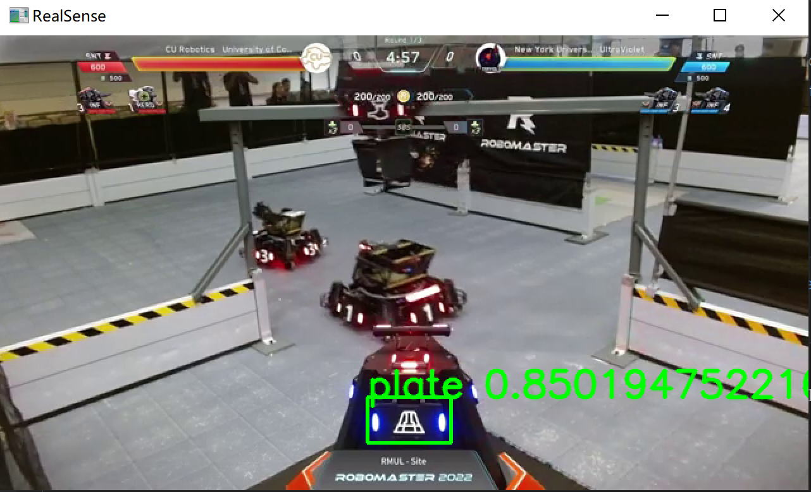
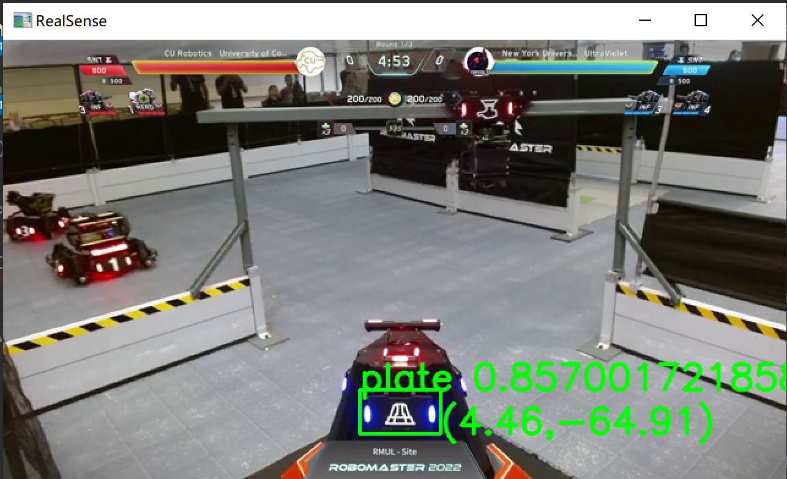
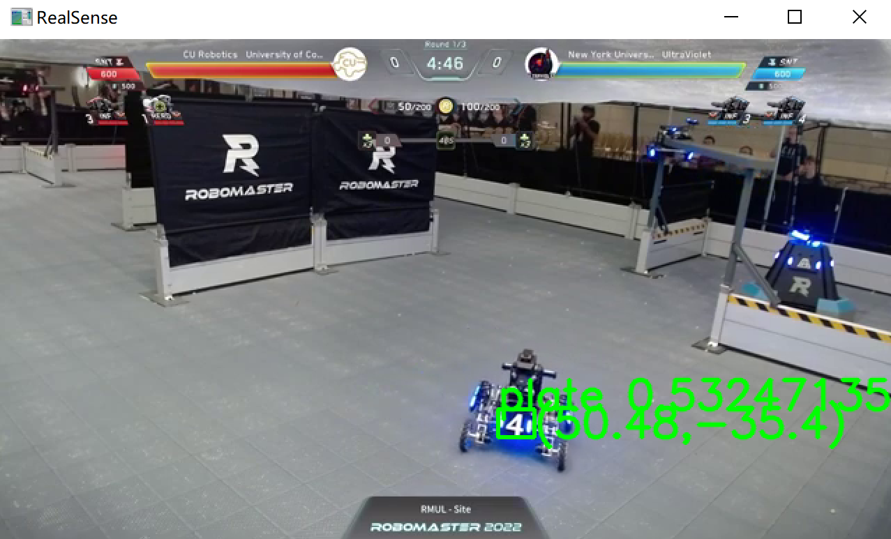

• Your name. 
Shangyu Xie

• For each portion, what design decisions did you make in order to achieve the program’s goals? What are the advantages of your implementation compared to others (see this)
My design idea is very straightforward. My is_blue program is very simple and easy to understand. This function first defines the value of blue, then calculates the area of the blue block, and finally judges whether the scoreboard is blue.

• For the object detection pipeline, did you use thresholding or another method to detect blue armor plates only? 
yes，When the blue area exceeds 19% of the overall area, the program will judge the scoreboard as blue

• For your SystemD pipeline, how did you select your service type, what launch after statement do you think is appropriate and why? How do you explain the difference?
systemd is a linux service. launch a python file immediately when jetson receives power. 

• Show working screenshots of each portion working, include these in a "screenshots" folder and embed them in your README. 

